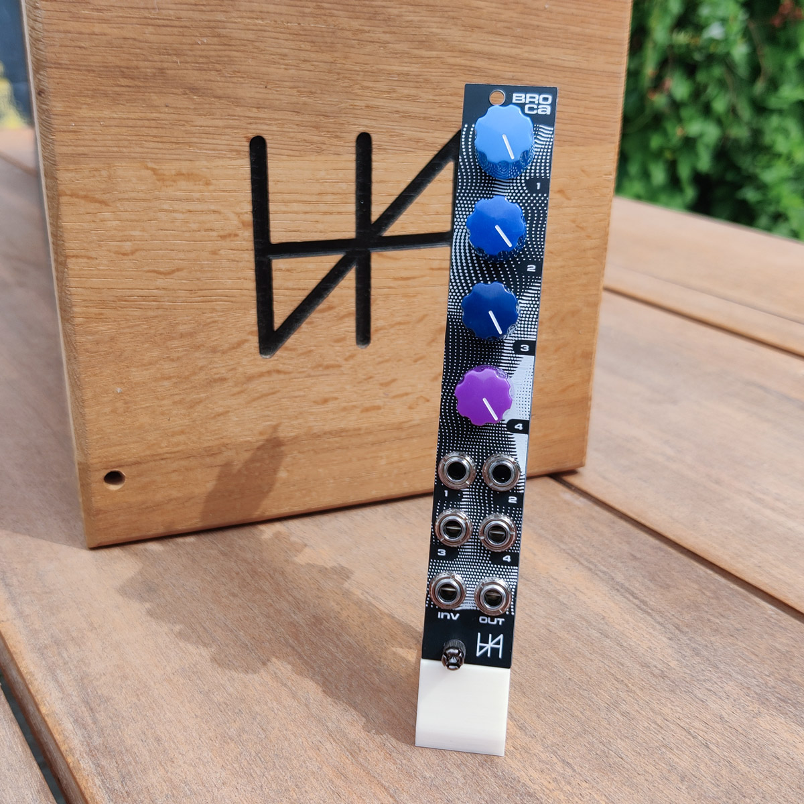
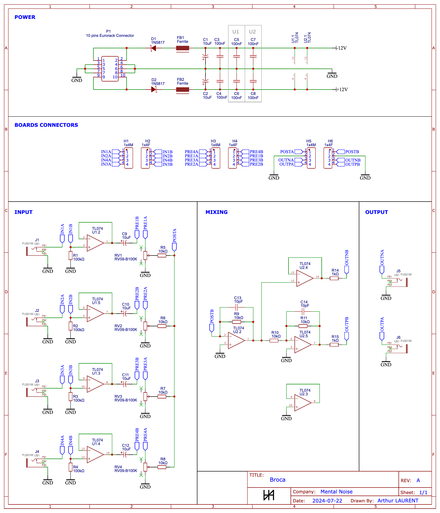

# Broca

A Simple 4 Channels Eurorack Audio Mixer.

This module is inspired by the [Doepfer A-138n](https://doepfer.de/a138n.htm) and uses some parts of the schematics of the [Befaco STMix](https://www.befaco.org/stmix/).

While inspired by those modules, it is better at handling audio signals because of the high quality capacitors it uses on the audio path and the better overall noise filtering.  

## Features

- 4 mono channels with independent volume control
- 1 output
- 1 inverted output
- High quality audio capacitors on the signal path (Nichicon MUSE ES Bipolar)
- Low ESR filtering capacitors on the power path
- 4 HP / 37mm depth
- 5mA +12V / 5mA -12V

This module is designed to mix audio signals with very low noise and distorsion.

Mixing CV signals is also possible but low frequency signals can get distorted in unexpected ways, try it and see if it works for you :)

While using high quality audio components, this module still end up being quite cheap to build if you order parts in bulk.  
However, if you want to make it for even cheaper or use more widely available components, feel free to replace the MUSE ES capacitors (C9, C10, C11, C12) and the low ESR capacitors (C1, C2) by any regular 10µF unipolar electrolytic capacitor.

## Where to buy

The module will soon be available on [my Tindie store](https://www.tindie.com/stores/mentalnoise/) as a kit or fully assembled but feel free to build it yourself from scratch using the resources in this repository.

Have a look on [ModularGrid](https://modulargrid.net/e/mental-noise-broca)!

## Schematics

All schematics can be found in the [schematics folder](./schematics).

The [build guide](./Mental%20Noise%20-%20Broca.pdf) is available as a PDF.

To import the schematics:
- Install EasyEDA at https://easyeda.com/ and download the standard edition
- Import [schematics.json](./schematics/schematics.json) in EasyEDA editor by clicking the document icon on the topbar, "Document" > "Open" > "EasyEDA Source", and select the json file

